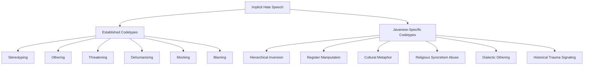

# Research Plan: Implicit Hate Speech Detection in Javanese
## "Unmasking the Unsaid: A Sociolinguistically-Informed Framework for Implicit Hate Speech Detection in Low-Resource Languages"

**Target Venues:** ACL 2026, EMNLP 2026, TACL
**Timeline:** Q1-Q2 2025 (relaxed, high-quality focus)
**Status:** Planning Phase

---

## 1. Research Questions

### RQ1: Taxonomy
> What are the unique linguistic and cultural mechanisms through which implicit hate speech is expressed in Javanese?

### RQ2: Annotation
> How can we develop objective, reproducible guidelines for annotating implicit hate speech in a highly contextual language?

### RQ3: Detection
> To what extent can transformers capture the sociolinguistic context required for implicit hate speech detection?

### RQ4: Cross-lingual Transfer
> How does implicit hate speech in Javanese compare to implicit hate in other languages?

---

## 2. Novel Contributions (For Submission)

### 2.1 Javanese Implicit Hate Speech Taxonomy (JIHST)

A novel taxonomy extending existing implicit hate speech codetypes with Javanese-specific mechanisms:



#### Established Codetypes (from literature):
1. **Stereotyping** - Generalisasi negatif tentang kelompok
2. **Othering** - Memisahkan "kita" vs "mereka"
3. **Threatening** - Ancaman terselubung
4. **Dehumanizing** - Menyangkal kemanusiaan
5. **Mocking** - Mengejek/merendahkan
6. **Blaming** - Menyalahkan kelompok

#### Javanese-Specific Codetypes (NEW):

| Codetype | Deskripsi | Contoh | Penjelasan |
|----------|-----------|--------|------------|
| **Hierarchical Inversion** | Membalik hierarki sosial yang dimengerti secara kultural | "Wong cilik iku sing nyekel negara kok, dadi wong gedhe ra kuat ngapa-ngapa" | Mengklaim "orang kecil" menguasai negara, "orang besar" tidak berdaya - ironi sosial |
| **Register Manipulation** | Menggunakan tingkatan bahasa Jawa secara tidak pantas | Menggunakan **ngoko** kepada orang yang seharusnya dipakai **krama** | Pelanggaran sopan santun sebagai bentuk penghinaan |
| **Cultural Metaphor** | Metafora budaya Jawa yang menyiratkan ketidaksukaan | "Kaya kucing kepentok wedhus" - mengolok-olok ketidakmampuan | Metafora budaya yang tidak dimengerti orang luar |
| **Religious Syncretism Abuse** | Memanfaatkan sinkretisme agama Jawa-Islam-Hindu | Mengolok tradisi kejawen dalam konteks modern | Menyinggung praktik keagamaan tradisional |
| **Dialectic Othering** | Diskriminasi berdasarkan dialek | Ngejek logat Banyumasan, Arekan, atau Mataraman | "Arek-arek iku oake banget ngomonge" |
| **Historical Trauma Signaling** | Referensi sejarah menyakitkan | Referensi konflik historis tanpa menyebut langsung | Trigger memori kolektif yang menyakitkan |

### 2.2 JIHSD Dataset (Javanese Implicit Hate Speech Dataset)

- **Target:** 5,000-10,000 carefully annotated samples
- **Multi-label annotation:** Each text annotated for:
  - Binary: Hate / Non-Hate
  - Implicit: Explicit / Implicit / Borderline
  - Codetypes: Multiple applicable codetypes
  - Target: Etnis, Agama, Gender, Regional, Sosial
  - Context Required: Yes/No (apakah butuh penjelasan budaya)
  - Severity Score: 0.0-1.0 (continuous)

- **Quality Control:**
  - 3 annotators per sample
  - Expert validation (ahli bahasa/sosiolog)
  - Inter-annotator agreement targets: κ ≥ 0.80

### 2.3 Context-Aware Detection Model

Novel architecture incorporating:
1. **Sociolinguistic Feature Encoder** - Speech level detection
2. **Cultural Knowledge Module** - External knowledge about Javanese culture
3. **Multi-Task Learning** - Simultaneous hate detection + codetype classification

---

## 3. Related Work (Literature Review)

### 3.1 Hate Speech Detection
- **Binary vs Multi-class:** [Zampieri et al., 2019; Fortuna & Nunes, 2018]
- **Implicit Hate:** [ElSherief et al., 2021; Celik et al., 2024]

### 3.2 Implicit Hate Speech Taxonomies
- **6 Codetypes:** [ElSherief et al., 2021] - baseline kami
- **Implicit encoding strategies:** [2025 arxiv paper]

### 3.3 Low-Resource Languages
- **Cross-lingual transfer:** [Prego et al., 2024]
- **African languages:** [Muhammad et al., 2024]

### 3.4 Sociolinguistics in NLP
- **Register detection:** [Heylighen, 2008; various]
- **Politeness:** [Danescu-Niculescu-Mizil et al., 2013]

### 3.5 Javanese NLP (very limited)
- **Existing work:** [Citation hunt needed]
- **Gap:** No work on implicit hate speech in Javanese

---

## 4. Methodology

### 4.1 Phase 1: Taxonomy Development (Weeks 1-2)

**Output:** Validated taxonomy document

**Activities:**
1. Study existing implicit hate taxonomies
2. Analyze 500+ Javanese social media samples for patterns
3. Consult with:
   - Ahli bahasa Jawa (linguist)
   - Sosiolog Indonesian
   - Native speaker dari berbagai daerah
4. Iterative refinement
5. Create decision tree for annotation

**Deliverable:** `JIHST_Taxonomy_v1.0.pdf`

### 4.2 Phase 2: Annotation Guidelines (Weeks 3-4)

**Output:** Reproducible annotation manual

**Structure:**
```markdown
# Javanese Implicit Hate Speech Annotation Guidelines

## 1. Overview
## 2. Binary Classification: Hate vs Non-Hate
## 3. Explicit vs Implicit
## 4. Codetype Definitions with Examples
### 4.1 Established Codetypes
### 4.2 Javanese-Specific Codetypes
## 5. Annotation Procedure
## 6. Edge Cases and Decision Trees
## 7. Quality Control
```

**Key Principle:** Annotator should agree 90%+ time

### 4.3 Phase 3: Data Collection (Weeks 5-8)

**Sources:**
- Twitter/X (Indonesian region with Javanese speakers)
- Instagram comments
- Reddit Indonesia (r/indonesia, regional subreddits)
- Facebook groups
- Local forums (Kaskus, etc.)

**Sampling Strategy:**
1. **Keyword-based** - hate-related terms in Javanese
2. **Random sampling** - for implicit cases (no keywords)
3. **Balanced sampling** - different regions (Banyumas, Arekan, Mataraman)

**Preprocessing:**
- Language identification (separate Javanese from Indonesian/mixed)
- Deduplication
- Privacy scrubbing

### 4.4 Phase 4: Annotation (Weeks 9-16)

**Team:** 3 annotators + 1 expert validator

**Process:**
```
Round 1: Each annotator labels 1/3 of data independently
Round 2: Rotate samples for second annotation
Round 3: Expert adjudication of disagreements
Round 4: Final refinement
```

**Tools:**
- Doccano / Label Studio for annotation
- Custom agreement calculator
- Version control for guidelines

### 4.5 Phase 5: Model Development (Weeks 17-24)

**Baselines:**
1. **IndoBERT** - Base pre-trained model
2. **XLM-RoBERTa** - Multilingual
3. **mBERT** - Multilingual BERT

**Proposed Models:**

#### Model A: Context-Augmented BERT
```
Input: Text + Cultural Context Features
        ↓
BERT Encoding
        ↓
[CLS] + Context Features
        ↓
Classification Head
```

#### Model B: Multi-Task Learning
```
Shared Encoder
        ↓
    ┌───┴───┬─────┐
    ↓       ↓     ↓
Hate  Implicit  Codetype
Det   Det       Class
```

#### Model C: Retrieval-Augmented
```
Input Text
        ↓
Retrieve similar cultural contexts
        ↓
Augment input
        ↓
BERT Encoding + Context
        ↓
Classification
```

### 4.6 Phase 6: Analysis & Writing (Weeks 25-32)

**Paper Structure:**
1. **Abstract** - 250 words
2. **Introduction** - Motivate implicit hate problem
3. **Related Work** - Literature review
4. **The Javanese Context** - Background on language/culture
5. **Taxonomy** - Our contribution
6. **Dataset** - Collection, annotation, statistics
7. **Methodology** - Models
8. **Experiments** - Setup, baselines, results
9. **Analysis** - Error analysis, case studies
10. **Conclusion & Future Work**

---

## 5. Experimental Design

### 5.1 Research Questions Mapping to Experiments

| RQ | Experiment | Metrics |
|----|------------|---------|
| RQ1 (Taxonomy) | Annotation agreement, distribution analysis | Cohen's Kappa, label distribution |
| RQ2 (Annotation) | Inter-annotator agreement over iterations | Kappa progression, adjudication rate |
| RQ3 (Detection) | Model comparison, ablation study | F1, Precision, Recall, AUC |
| RQ4 (Cross-lingual) | Transfer learning from other languages | Zero-shot performance |

### 5.2 Baselines for Comparison

| Model | Type | Pre-training |
|-------|------|--------------|
| IndoBERT | Single-language | Indonesian Wikipedia + CC |
| XLM-RoBERTa | Multilingual | 100 languages |
| mBERT | Multilingual | 104 languages |
| GPT-4 (API) | LLM | - |
| DeepSeek-Coder | LLM | - |

### 5.3 Evaluation Metrics

**Binary Classification:**
- Accuracy, F1, Precision, Recall
- AUC-ROC

**Multi-label (Codetypes):**
- Macro F1, Micro F1
- Hamming loss

**Implicit vs Explicit:**
- Confusion matrix analysis
- Per-class performance

**Qualitative:**
- Error analysis by codetype
- Case studies on model failures

---

## 6. Risk Mitigation

| Risk | Impact | Mitigation |
|------|--------|------------|
| Low inter-annotator agreement | High | Iterative guideline refinement, expert validation |
| Insufficient implicit examples | Medium | Active learning to find implicit cases |
| Model fails to capture context | High | Incorporate explicit cultural features |
| Reviewer rejection on methodology | Medium | Follow established best practices, transparency |
| Dataset size too small | Low | Target 5K-10K, sufficient for SOTA methods |

---

## 7. Timeline (32 Weeks / ~8 Months)

```
Month 1:  Literature Review + Taxonomy Development
Month 2:  Annotation Guidelines + Pilot Study
Month 3:  Data Collection Setup
Month 4:  Data Collection Continued
Month 5:  Annotation Round 1-2
Month 6:  Annotation Round 3 + Expert Validation
Month 7:  Model Development + Experiments
Month 8:  Analysis + Paper Writing
```

**Milestones:**
- Week 4: Taxonomy finalized
- Week 8: Guidelines validated (pilot κ ≥ 0.7)
- Week 16: Dataset complete
- Week 24: Experiments complete
- Week 32: Paper submitted

---

## 8. Resources Needed

### 8.1 Human Resources
- 1 Lead Researcher (you)
- 2-3 Annotators (native Javanese speakers)
- 1 Expert validator (linguist/sociologist)
- 1 ML engineer (optional)

### 8.2 Computing Resources
- GPU for training (RTX 3060 Ti available)
- Storage for dataset/models

### 8.3 Software Tools
- Annotation: Doccano / Label Studio
- ML: PyTorch, Transformers, HuggingFace
- Analysis: Pandas, Scikit-learn, Matplotlib

---

## 9. Expected Outcomes

### 9.1 Academic Impact
- **Novel taxonomy** - Citations from future implicit hate work
- **Dataset** - Resource for Javanese/low-resource NLP
- **Methodology** - Template for other low-resource languages

### 9.2 Target Venues (Priority Order)

| Venue | Deadline | Type | Notes |
|-------|----------|------|-------|
| **ACL 2026** | ~Feb 2026 | Conference | Top NLP venue |
| **EMNLP 2026** | ~Jun 2026 | Conference | Strong for empirical work |
| **NAACL 2026** | ~Oct 2025 | Conference | Regional but top-tier |
| **TACL** | Rolling | Journal | High impact, long review |
| **COLING 2026** | ~Mar 2026 | Conference | Good NLP venue |

### 9.3 Backup Plan
If top venues reject:
- **LREC** (focus on resources)
- **INTERSPEECH** (if speech aspect added)
- **AAAI** (broad AI, accepts NLP)

---

## 10. Success Criteria

### Minimum Viable Paper:
- [ ] Novel taxonomy clearly described
- [ ] Dataset released with proper documentation
- [ ] At least 2 baseline models compared
- [ ] Statistical significance demonstrated
- [ ] Error analysis provided

### Strong Paper:
- [ ] All above +
- [ ] Novel model architecture with ablation
- [ ] Cross-lingual experiments
- [ ] Qualitative analysis with examples
- [ ] Code released

### Excellent Paper (ACL/EMNLP level):
- [ ] All above +
- [ ] State-of-the-art results
- [ ] Theoretical contribution justified
- [ ] Broad experiments (multiple baselines)
- [ ] Human evaluation included
- [ ] Clear implications for future work

---

## 11. Next Steps (Immediate Actions)

1. **Literature Review Deep Dive**
   - Read all implicit hate speech papers
   - Study Javanese sociolinguistics
   - Document related work gaps

2. **Expert Consultation**
   - Identify potential Javanese linguists
   - Prepare interview questions about implicit hate
   - Document cultural insights

3. **Pilot Data Collection**
   - Collect 500 samples for initial analysis
   - Identify patterns manually
   - Refine taxonomy based on observations

4. **Start Writing Related Work**
   - Begin with what we know
   - Update as new papers discovered

---

**Status:** Ready to begin Phase 1
**Last Updated:** 2025-01-08
**Owner:** Research Team
