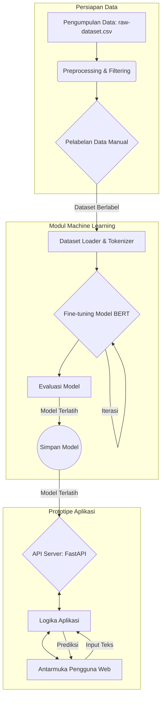

# Arsitektur Sistem - Deteksi Ujaran Kebencian Bahasa Jawa

**Versi:** 0.2
**Tanggal:** 29 Mei 2025

Dokumen ini menjelaskan arsitektur yang direncanakan untuk sistem deteksi ujaran kebencian Bahasa Jawa. Arsitektur ini bersifat modular untuk memungkinkan pengembangan dan iterasi yang lebih mudah.

## Komponen Utama:



## Deskripsi Komponen:

1.  **Pengumpulan Data:**
    * **Tanggung Jawab:** Menggunakan dataset teks berbahasa Jawa yang sudah ada dan tersimpan dalam format CSV (`raw-dataset.csv`).
    * **Teknologi:** Skrip Python, Pandas.
    * **Input:** File `raw-dataset.csv` yang berada di direktori `src/data_collection/`.
    * **Output:** Dataset mentah dalam bentuk DataFrame Pandas.

2.  **Preprocessing & Filtering Data:**
    * **Tanggung Jawab:** Membersihkan dan memformat data mentah.
    * **Teknologi:** Python, Pandas, NLTK/Sastrawi.
    * **Input:** Dataset mentah dari Google Sheets.
    * **Output:** Dataset yang sudah dibersihkan dan diformat.

3.  **Pelabelan Data:** [cite: 7, 55, 57, 85, 95, 96, 97]
    * **Tanggung Jawab:** Melakukan pelabelan data secara manual dengan melibatkan ahli bahasa Jawa dan budayawan. Kategori label: ringan, sedang, berat, bukan ujaran kebencian. Konteks budaya dan tingkatan bahasa menjadi pertimbangan.
    * **Output:** Dataset teks berlabel yang siap untuk pelatihan model. Pedoman pelabelan.

4.  **Modul Machine Learning:**
    * **Dataset Loader & Tokenizer:**
        * **Tanggung Jawab:** Memuat dataset berlabel, melakukan tokenisasi teks menggunakan tokenizer dari model BERT (IndoBERT).
        * **Teknologi:** Python, Hugging Face Datasets/Pandas, Hugging Face Tokenizers.
    * **Model BERT (Fine-tuning & Lapisan Klasifikasi):** [cite: 58, 59, 100, 101, 103]
        * **Tanggung Jawab:** Menggunakan model IndoBERT pre-trained, melakukan fine-tuning dengan dataset Bahasa Jawa berlabel. Menambahkan lapisan klasifikasi untuk tugas deteksi ujaran kebencian dengan 4 kelas: **Bukan Ujaran Kebencian, Ujaran Kebencian Ringan, Ujaran Kebencian Sedang,** dan **Ujaran Kebencian Berat**.
        * **Teknologi:** Python, Hugging Face Transformers, PyTorch/TensorFlow.
    * **Evaluasi Model:** [cite: 54, 60, 61, 106, 107]
        * **Tanggung Jawab:** Mengukur performa model menggunakan metrik kuantitatif (akurasi, presisi, recall, F1-score) dan analisis confusion matrix. Melakukan analisis kualitatif terhadap kesalahan klasifikasi.
        * **Teknologi:** Python, Scikit-learn, Matplotlib/Seaborn.
    * **Output:** Model terlatih (.bin, .pt, atau format lain), laporan evaluasi, visualisasi.

5.  **Prototipe Aplikasi:**
    * **API Server:** [cite: 7, 62, 108]
        * **Tanggung Jawab:** Menyediakan endpoint untuk prediksi.
        * **Teknologi:** FastAPI/Flask.
    * **Logika Aplikasi:**
        * **Tanggung Jawab:** Menangani request API, melakukan preprocessing pada input pengguna, memanggil model untuk prediksi, dan memformat output.
    * **Antarmuka Pengguna (Web - Sederhana):** [cite: 109]
        * **Tanggung Jawab:** Menyediakan antarmuka web sederhana bagi pengguna untuk memasukkan teks dan melihat hasil klasifikasi.
        * **Teknologi:** HTML, CSS, JavaScript.
    * **Output:** Prototipe API yang berfungsi dan antarmuka pengguna web.

## Alur Kerja Utama (Prediksi):

1.  Pengguna memasukkan teks Bahasa Jawa melalui Antarmuka Pengguna atau langsung ke API Server.
2.  API Server menerima teks dan meneruskannya ke Logika Aplikasi.
3.  Logika Aplikasi melakukan preprocessing pada teks input (mirip dengan preprocessing saat training).
4.  Teks yang sudah diproses ditokenisasi.
5.  Model BERT yang sudah di-fine-tune melakukan prediksi.
6.  Hasil prediksi (kelas ujaran kebencian dan/atau tingkatannya) dikembalikan oleh Logika Aplikasi ke API Server.
7.  API Server mengirimkan respons (misalnya, format JSON) kembali ke Antarmuka Pengguna atau pemanggil API.
8.  Antarmuka Pengguna menampilkan hasil klasifikasi kepada pengguna.

## Pertimbangan Desain:

* **Modularitas:** Setiap komponen dirancang untuk independen sejauh mungkin untuk memudahkan pengembangan, pengujian, dan pembaruan.
* **Iterasi:** Arsitektur mendukung iterasi, terutama pada Modul Machine Learning (pelatihan ulang dengan data lebih banyak, penyesuaian model) dan Prototipe Aplikasi (penambahan fitur).
* **Konfigurasi:** Parameter model, path file, dan konfigurasi lainnya akan dikelola secara eksternal (misalnya, file `.env` atau konfigurasi).

## Diagram Alir Data (Sederhana)

```
[raw-dataset.csv] -> [Preprocessing] -> [Pelabelan] -> [Training Model] -> [Model Tersimpan] -> [API Server]
```

## Interaksi Antar Komponen
1.  Skrip preprocessing memuat data dari `raw-dataset.csv`.
2.  Data yang sudah bersih dan berlabel digunakan untuk melatih model.
3.  Model yang sudah terlatih disimpan dalam direktori `models/`.
4.  API Server memuat model yang tersimpan untuk melakukan prediksi pada data baru yang masuk.

---