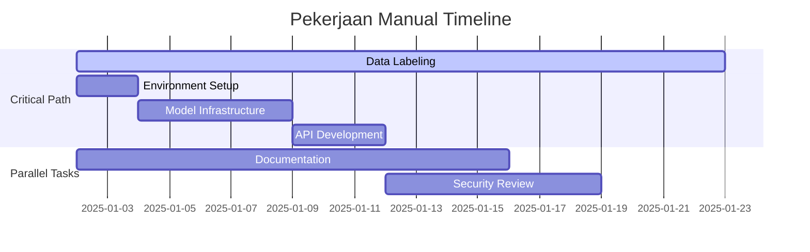

# Pekerjaan Manual yang Diperlukan - Review Arsitek Software

**Tanggal:** 2 Januari 2025  
**Arsitek:** Mukhlis Amien  
**Status:** Prioritas Tinggi  

## 🎯 Ringkasan Eksekutif

Berdasarkan review mendalam terhadap arsitektur dan implementasi saat ini, proyek sudah memiliki fondasi yang solid dengan struktur modular yang baik. Namun, ada beberapa area kritis yang memerlukan pekerjaan manual untuk memastikan sistem siap untuk tahap pengembangan model dan deployment.

## 📋 Pekerjaan Manual Prioritas Tinggi

### 1. Data Labeling dan Quality Assurance (URGENT)
**Assignee:** Mukhlis Amien  
**Estimasi:** 2-3 minggu  
**Dependencies:** Pedoman pelabelan sudah tersedia

#### Tugas Spesifik:
- [ ] **Pelabelan Manual 500 Sampel Awal**
  - Gunakan pedoman di `petunjuk-pekerjaan-manual.md`
  - Fokus pada 4 kategori: Bukan Ujaran Kebencian, Ringan, Sedang, Berat
  - Dokumentasikan edge cases dan ambiguitas
  - Target: 125 sampel per kategori untuk balanced dataset

- [ ] **Quality Control**
  - Review konsistensi pelabelan setiap 100 sampel
  - Buat catatan untuk kasus-kasus sulit
  - Validasi dengan ahli bahasa Jawa (jika tersedia)

- [ ] **Inter-annotator Agreement**
  - Jika ada annotator kedua, hitung Cohen's Kappa
  - Target minimum: κ > 0.7
  - Resolusi konflik pelabelan

### 2. Environment Setup dan Dependencies
**Assignee:** Mukhlis Amien + Tim Developer  
**Estimasi:** 1-2 hari  

#### Tugas Spesifik:
- [ ] **Install Dependencies**
  ```bash
  pip install -r requirements.txt
  ```
  - Verifikasi semua package terinstall dengan benar
  - Test import semua library utama
  - Dokumentasikan jika ada konflik dependencies

- [ ] **Environment Configuration**
  - Buat file `.env` berdasarkan template di `src/config/settings.py`
  - Set path yang benar untuk dataset dan model
  - Konfigurasi logging directories

- [ ] **Testing Infrastructure**
  ```bash
  pytest tests/ -v --cov=src
  ```
  - Pastikan semua test pass
  - Verifikasi coverage >80%

### 3. Model Training Infrastructure Setup
**Assignee:** Tim Developer (jules_dev2)  
**Estimasi:** 3-5 hari  

#### Tugas Spesifik:
- [ ] **Hugging Face Setup**
  - Verifikasi akses ke IndoBERT model
  - Test tokenization dengan sample Javanese text
  - Setup model download dan caching

- [ ] **Training Pipeline**
  - Implementasi data loader untuk labeled dataset
  - Setup training loop dengan proper validation
  - Implementasi model checkpointing

- [ ] **Evaluation Framework**
  - Implementasi metrics calculation (accuracy, F1, precision, recall)
  - Confusion matrix visualization
  - Model performance reporting

### 4. API Development Preparation
**Assignee:** jules_dev2 + Hashfi  
**Estimasi:** 2-3 hari  

#### Tugas Spesifik:
- [ ] **FastAPI Setup**
  - Basic API structure dengan health check endpoint
  - Request/response models dengan Pydantic
  - Error handling middleware

- [ ] **Authentication System**
  - API key based authentication
  - Rate limiting implementation
  - CORS configuration

- [ ] **API Documentation**
  - OpenAPI/Swagger documentation
  - Example requests dan responses
  - Integration guide

## 🔧 Pekerjaan Manual Prioritas Menengah

### 5. Documentation dan Standards
**Assignee:** jules_dokumen  
**Estimasi:** 1-2 minggu  

- [ ] **Code Standards Documentation**
  - Python coding standards (PEP 8)
  - Docstring conventions
  - Git commit message format

- [ ] **Deployment Guide**
  - Docker containerization
  - Environment setup untuk production
  - Monitoring dan logging setup

### 6. Security dan Compliance
**Assignee:** Mukhlis Amien  
**Estimasi:** 1 minggu  

- [ ] **Data Privacy Review**
  - Ensure no sensitive data logging
  - Data retention policies
  - GDPR compliance considerations

- [ ] **Security Audit**
  - API security review
  - Input validation
  - SQL injection prevention (jika ada database)

## 📊 Timeline dan Dependencies



## 🚨 Risiko dan Mitigasi

### Risiko Tinggi:
1. **Kualitas Data Labeling**
   - **Risiko:** Inconsistent labeling dapat merusak model performance
   - **Mitigasi:** Double-check random samples, gunakan clear guidelines

2. **Model Performance**
   - **Risiko:** IndoBERT mungkin tidak optimal untuk Javanese
   - **Mitigasi:** Prepare fallback dengan model lain, extensive evaluation

### Risiko Menengah:
1. **Dependencies Conflicts**
   - **Risiko:** Library incompatibility
   - **Mitigasi:** Use virtual environment, pin versions

2. **API Performance**
   - **Risiko:** Slow response time
   - **Mitigasi:** Implement caching, optimize model loading

## 📞 Kontak dan Eskalasi

- **Arsitek:** Mukhlis Amien (mukhlis.amien@example.com)
- **Lead Developer:** jules_dev2
- **Documentation:** jules_dokumen

**Eskalasi Path:**
1. Technical issues → jules_dev2
2. Architecture decisions → Mukhlis Amien
3. Project timeline → Mukhlis Amien

---

**Next Review:** 9 Januari 2025  
**Status Update:** Weekly (setiap Rabu)