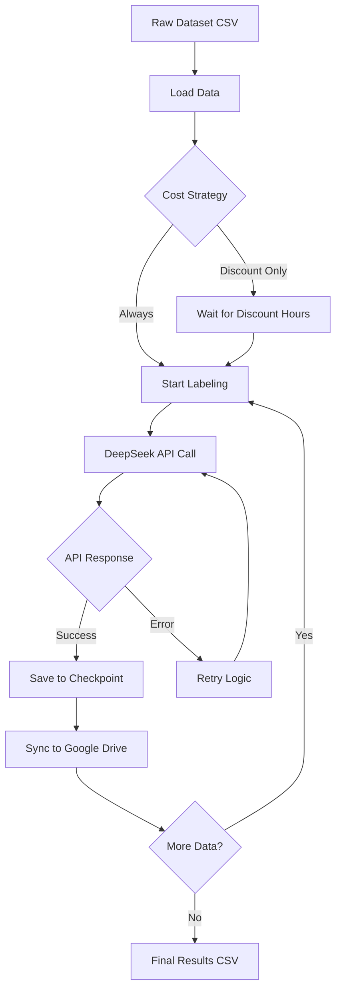
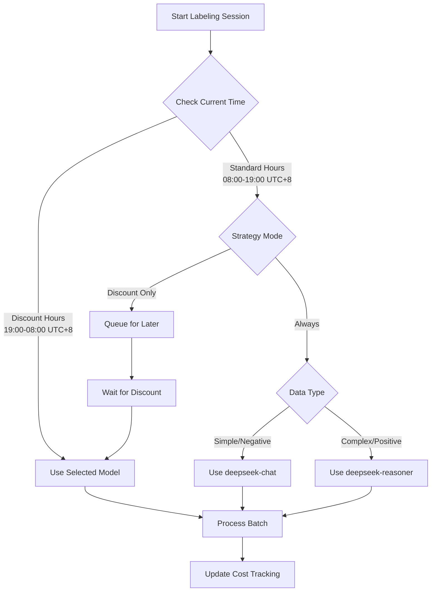
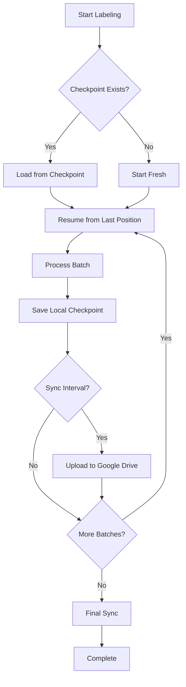
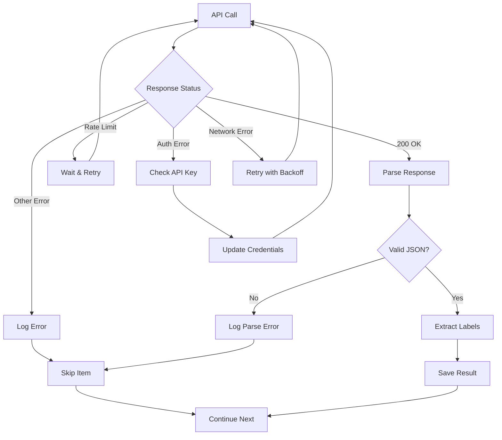
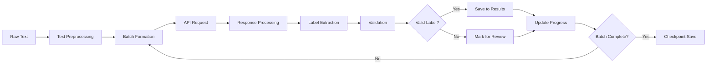
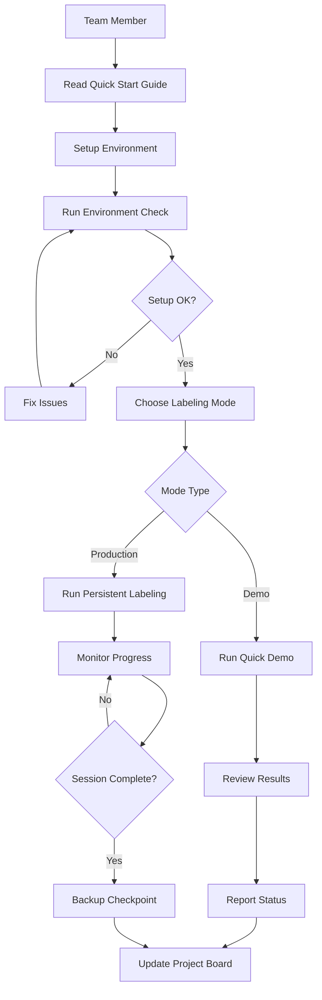
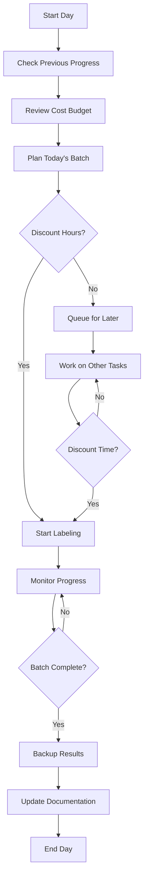

# Workflow Diagram - Labeling System

## 1. Overall System Flow

## 2. Cost Optimization Flow

## 3. Persistence & Checkpoint Flow

## 4. Error Handling Flow

## 5. Data Processing Pipeline

## 6. Team Workflow

## 7. Daily Operations Flow

## Key Components

### Input Files
- `src/data_collection/raw-dataset.csv` - Raw unlabeled data
- `.env` - API keys and configuration
- `src/checkpoints/*.json` - Progress checkpoints

### Processing Scripts
- `src/demo_cost_efficient_labeling.py` - Quick demo
- `src/demo_persistent_labeling.py` - Production labeling
- `src/demo_cost_optimization.py` - Cost analysis

### Output Files
- `src/*-results.csv` - Labeled results
- `src/checkpoints/*.json` - Progress saves
- `src/logs/*.log` - Operation logs

### Utilities
- `src/utils/deepseek_client.py` - API client
- `src/utils/cost_optimizer.py` - Cost management
- `src/utils/cloud_checkpoint_manager.py` - Google Drive sync

## Time Estimates

| Task | Duration | Notes |
|------|----------|-------|
| Environment Setup | 5-10 min | First time only |
| Quick Demo (10 items) | 2-3 min | Testing purposes |
| Batch Labeling (100 items) | 15-30 min | Depends on model |
| Checkpoint Sync | 1-2 min | Per batch |
| Daily Backup | 5 min | End of day |

## Cost Optimization Schedule

| Time (UTC+8) | Status | Recommended Action |
|--------------|--------|--------------------|
| 08:00-19:00 | Standard Rate | Use discount-only mode or simple model |
| 19:00-08:00 | Discount Rate | Full labeling with any model |

---

**Note**: Diagram ini menggunakan Mermaid syntax. Untuk visualisasi yang lebih baik, gunakan tools yang mendukung Mermaid seperti GitHub, GitLab, atau Mermaid Live Editor.